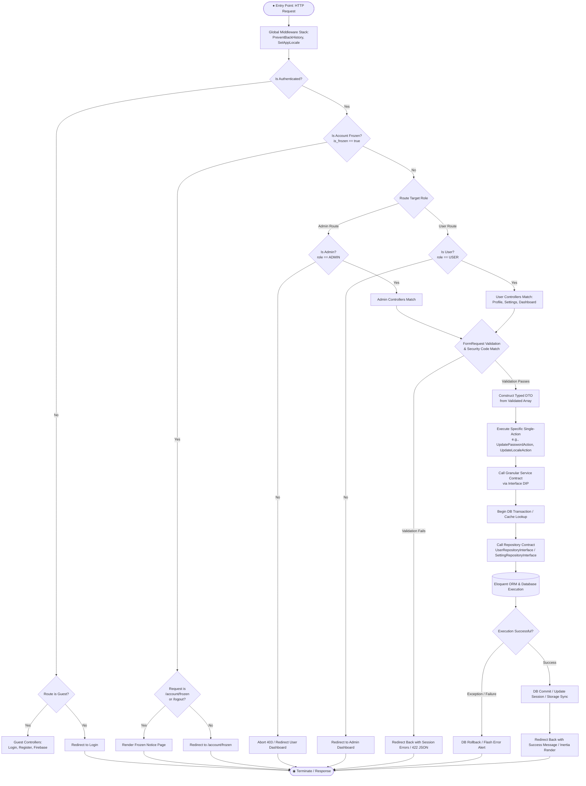

# 🛍️ K-Tienda en Línea Enterprise Platform

Platform E-Commerce modern berbasis **Laravel 12**, **Inertia.js**, dan **React** yang dirancang dengan standar arsitektur kelas enterprise, fokus pada performa tinggi, pengalaman pengguna (UI/UX) yang intuitif, pemisahan peran yang tegas (**Admin & User**), lokalisasi multibahasa penuh (**i18n**), serta sistem keamanan autentikasi yang ketat.

---

## 📖 1. Deskripsi Aplikasi

**K-Tienda en Línea** adalah sistem pengelolaan platform belanja daring (*e-commerce*) dengan panel administrasi modern dan area pengguna (*User*). Aplikasi ini memadukan keandalan arsitektur backend Laravel dengan kelincahan antarmuka SPA (*Single Page Application*) dari React via Inertia.js.

Sistem mendukung alur multi-role secara komprehensif:
- **Admin**: Mengelola pengaturan toko, memantau statistik pengguna, serta mengawasi dan mengelola akun pengguna (tindakan pembekuan akun kustom dan penghapusan akun permanen dari database dengan verifikasi kode keamanan).
- **Seller (Penjual)**: Membuka toko (*Store*), menambahkan daftar produk jualan ke etalase, dan memantau pesanan di Dashboard Seller khusus.
- **User (Pelanggan)**: Melakukan registrasi mandiri dari portal login atau Google Firebase Auth, masuk ke dashboard pengguna khusus untuk melihat daftar produk, mengelola profil dan avatar, mengatur preferensi bahasa antarmuka, memperbarui kata sandi mandiri, mengelola sesi aktif, serta terproteksi oleh sistem pembekuan akun terintegrasi.

---

## 🎯 2. Tujuan Aplikasi

1. **Efisiensi Manajemen Toko & Pengguna**: Menyediakan pusat kendali (*command center*) bagi administrator untuk memantau daftar pengguna, mengonfigurasi toko, serta menindak akun pelanggar secara real-time.
2. **Kontrol Akun yang Aman (Anti-Human-Error)**: Menyediakan mekanisme pembekuan akun dengan pilihan durasi fleksibel (*Jam, Hari, Minggu, Bulan, Tahun*) serta proteksi konfirmasi 4-digit kode verifikasi acak sebelum tindakan pembekuan atau penghapusan permanen dieksekusi.
3. **Penegakan Akun Dibekukan (Frozen Account Guard)**: Mengalihkan pengguna yang sedang dibekukan ke portal pemberitahuan khusus (`/account/frozen`) dan mencegah transaksi maupun akses dashboard hingga masa berlaku pembekuan berakhir.
4. **Autentikasi Ganda (Manual & Firebase Social Login)**: Mendukung autentikasi email & kata sandi konvensional serta integrasi *Firebase Google Authentication*.
5. **Pemisahan Peran Tegas (Multi-Role RBAC)**: Memastikan rute Admin dan rute User terproteksi secara terpisah oleh middleware dengan pengalihan cerdas (*auto-redirect*) tanpa menimbulkan celah akses.
6. **Pusat Pengaturan Akun Mandiri (User Self-Service Settings)**: Memberikan keleluasaan bagi pelanggan untuk mengganti kata sandi secara aman, mengelola sesi aktif lintas-perangkat, memilih bahasa sistem, dan mengatur preferensi notifikasi.
7. **Internasionalisasi Penuh (Full Multilingual Support / i18n)**: Mendukung perpindahan bahasa antarmuka secara instan (**Bahasa Indonesia, English, Español**) yang tersinkronisasi di database pengguna dan sesi.
8. **Arsitektur Enterprise & Granular (SOLID & Clean Code)**: Membangun fondasi kode bersih berbasis *SOLID* & *Layered Architecture* dengan pemisahan service berdasarkan role dan fungsi spesifik (*Interface Segregation Principle* & *Single Responsibility Principle*).

---

## ✨ 3. Fitur-Fitur yang Tersedia

### 🛡️ Autentikasi, Registrasi & Keamanan (Security)
- **Role-Based Access Control (RBAC)**:
  - Pembatasan akses berbasis peran (`UserRole::ADMIN` dan `UserRole::USER`).
  - Middleware: `IsAdmin` (`admin`), `IsUser` (`user`), dan `EnsureAccountNotFrozen`.
  - **Auto-Redirect Cerdas**: Pengguna role `User` yang sengaja membuka URL `/dashboard` akan otomatis dialihkan ke `/user/dashboard`. Sebaliknya, `Admin` yang membuka `/user/dashboard` dialihkan ke `/dashboard`.
- **Registrasi Akun User Terintegrasi**:
  - Formulir registrasi langsung di portal login dengan transisi animasi mulus (*framer-motion*).
  - Kolom input: **Nama Lengkap**, **Nama Panggilan**, **Email**, dan **Kata Sandi**.
  - **Validasi Unik Case-Insensitive**: Penolakan otomatis jika nama panggilan sudah dipakai (`krisna`, `Krisna`, `KRISNA` dianggap sama).
- **Integrasi Firebase Authentication (Google Auth)**:
  - Mendukung login cepat dengan akun Google melalui Firebase Auth.
  - Sinkronisasi otomatis ke database lokal dengan pembuatan *unique nickname* otomatis.
- **Sesi Expired Otomatis saat Logout**: Ketika tombol logout diklik, sesi langsung dihancurkan (`invalidate`), token CSRF diregenerasi, dan sesi lama tidak dapat digunakan kembali.
- **Pencegahan Riwayat Browser (Anti Back-History Cache)**: Penerapan header anti-cache (`Cache-Control: no-cache, no-store, must-revalidate`) serta pembersihan client router state (`window.location.replace`).

---

### ⚙️ Panel Pengaturan Toko & Manajemen Pengguna (`/admin/settings`)
- **Daftar Akun Pengguna Non-Admin**:
  - Menampilkan daftar pelanggan dengan detail Nama Lengkap, Inisial Avatar, Email, Status Akun (`Aktif` atau `Dibekukan`), dan Tanggal Terdaftar.
  - Fitur pencarian instan (*instant search*) berdasarkan nama atau email.
  - Akun Administrator otomatis dikecualikan dari daftar tindakan untuk mencegah *self-lockout*.
- **Aksi Pembekuan Akun (Freeze Account) dengan Durasi Fleksibel**:
  - Admin dapat menentukan batas waktu pembekuan dengan satuan: **Jam**, **Hari**, **Minggu**, **Bulan**, atau **Tahun**.
  - Kolom opsional alasan pembekuan akun.
  - Tombol **Buka Beku (Unfreeze)** langsung untuk memulihkan akun seketika.
- **Aksi Hapus Akun Permanen (Delete User)**:
  - Menghapus akun pengguna beserta berkas avatar dari penyimpanan dan database secara permanen.
- **Proteksi 4-Digit Kode Keamanan Acak**:
  - Mencegah kesalahan klik (*accidental execution*). Admin diwajibkan mengetik ulang 4 karakter acak yang muncul di pop-up card sebelum tindakan pembekuan atau penghapusan dieksekusi.
  - Validasi ganda diterapkan di sisi klien (React) dan sisi server (Laravel FormRequest).
- **Pengaturan Umum Toko**:
  - Mengonfigurasi nama toko, deskripsi singkat, email kontak, nomor telepon/WhatsApp, dan bahasa sistem default platform.

---

### 🧊 Halaman Khusus Akun Dibekukan (`/account/frozen`)
- Pengguna yang status akunnya dibekukan otomatis dialihkan ke halaman pemberitahuan khusus ini saat login atau saat menjelajahi platform.
- Menampilkan informasi batas waktu pembekuan (`frozen_until`), sisa durasi pembekuan dalam format waktu relatif (`diffForHumans`), alasan pembekuan dari admin, serta tombol logout dan tautan bantuan.

---

### 🏪 Area Penjual / Seller Portal (`/seller`)
- **Dashboard Seller (`/seller/dashboard`)**: Pemantauan ringkas untuk toko.
- **Manajemen Produk (`/seller/products`)**:
  - Menambah produk dengan informasi *SKU* otomatis.
  - Memasukkan kategori, harga, deskripsi, dan sisa stok.
  - Menghapus produk dari etalase.
  - Status produk dikelola secara ketat berbasis *Enum* (`ProductStatus`).

---

### 🛍️ Area Pengguna / User Portal

#### 1. Dashboard Pengguna (`/user/dashboard`)
- Tampilan salam personalisasi (*welcome banner*) berbasis nama panggilan (`nickname`) pengguna.
- Ringkasan profil singkat, alamat pengiriman, dan status modul pengguna yang terintegrasi rapi dengan navbar dan sidebar.
- Menampilkan **Daftar Rekomendasi Produk** secara grid dari seluruh toko, dilindungi dari masalah *N+1 Query*.

#### 2. Modul Profil Pengguna (`/user/profile`)
- **Informasi Pribadi**: Mengelola nama lengkap, nama panggilan/username unik, email (read-only), tanggal lahir, tempat lahir, dan alamat lengkap tempat tinggal.
- **Manajemen Foto Profil (Avatar)**:
  - Pratinjau langsung sebelum berkas diunggah.
  - Validasi ketat di sisi klien & server: format didukung (JPG, PNG, WEBP) dan batasan ukuran maksimal 2MB.
  - Tombol hapus foto profil permanen dengan konfirmasi dialog.

#### 3. Pengaturan Akun Pengguna (`/user/settings`)
Pusat pengaturan akun terpadu dengan navigasi tab mulus (*smooth tab transition*):
- **Keamanan & Kata Sandi (`SecurityCard`)**:
  - Formulir ganti kata sandi dengan verifikasi kata sandi saat ini (`current_password`).
  - Indikator kekuatan kata sandi real-time (*Password Strength Meter*: *Sangat Lemah, Lemah, Cukup, Kuat, Sangat Kuat*).
  - Checklist validasi syarat sandi: minimal 8 karakter, kombinasi angka, dan simbol.
  - Tanda kecocokan konfirmasi sandi secara visual.
  - Informasi jaminan enkripsi standar industri (*Bcrypt hashing*).
  - **Sesi & Perangkat Aktif**: Memantau perangkat yang sedang login serta fitur **Keluar dari Semua Perangkat Lain** untuk mengakhiri sesi aktif di komputer/browser lain dengan dialog konfirmasi aman.
- **Preferensi Bahasa (`PreferencesCard`)**:
  - Pilihan bahasa sistem / antarmuka: **Bahasa Indonesia 🇮🇩**, **English (US) 🇺🇸**, dan **Español 🇪🇸**.
  - Modal konfirmasi perubahan bahasa yang otomatis menyesuaikan teks ke bahasa target.
  - Perubahan bahasa langsung tersimpan ke kolom `locale` di tabel `users` serta sesi aplikasi.
- **Pengaturan Notifikasi (`NotificationCard`)**:
  - Pengaturan preferensi switch notifikasi untuk:
    - *Status Pesanan & Pengiriman*
    - *Promo, Diskon & Flash Sale*
    - *Peringatan Keamanan Akun*
    - Saluran komunikasi: *Notifikasi Email* dan *Push Notifikasi Peramban*.
- **Akun Tertaut & Integrasi (`PrivacyAndDangerCard`)**:
  - Informasi status tautan login sosial Google (Firebase Auth).

---

### 🌐 4. Internasionalisasi & Multibahasa Penuh (i18n)
Aplikasi mendukung 3 bahasa utama:
- 🇮🇩 **Bahasa Indonesia (`id`)**
- 🇺🇸 **English (`en`)**
- 🇪🇸 **Español (`es`)**

Arsitektur lokalisasi:
- File kamus terpusat di `lang/{locale}.json` dengan lebih dari 200+ frasa yang tersinkronisasi.
- Middleware `SetAppLocale` membaca preferensi dengan urutan prioritas: Sesi pengguna ➔ Kolom `users.locale` ➔ Pengaturan database toko ➔ Konfigurasi default aplikasi.
- Seluruh teks pada komponen React dikonsumsi melalui custom hook `useTranslation()` yang membaca `props.translations` dari Inertia.

---

### 📊 Dashboard Monitoring Admin (`/admin/dashboard`)
- Statistik Akun Real-Time: Total Pengguna, Total Admin, dan Total Keseluruhan Akun.
- Daftar pendaftar pengguna terbaru (*recent users*).

---

## 🏛️ 5. Arsitektur yang Dipakai

Aplikasi ini mengadopsi pola **Granular Layered Architecture** tingkat lanjut (Enterprise Pattern) yang mematuhi prinsip **SOLID** (terutama **Single Responsibility Principle / SRP**, **Interface Segregation Principle / ISP**, dan **Dependency Inversion Principle / DIP**):

```
[ Frontend: React + Inertia.js + Tailwind CSS + Framer Motion ]
                          │  (HTTP Request / Form Submit)
                          ▼
               [ Controller Layer ]
  (UserManagementController, SettingsController, ProfileController,
   User/SettingsController, FrozenNoticeController, FirebaseAuthController)
                          │
         ┌────────────────┴────────────────┐
         ▼                                 ▼
[ FormRequest Layer (SRP Validation) ]   [ DTO Layer (Type Safety) ]
  (UpdatePasswordRequest,                  (UpdatePasswordDTO,
   UpdateLocaleRequest,                     UpdateLocaleDTO,
   FreezeUserRequest, etc.)                 FreezeUserDTO, etc.)
         │                                 │
         └────────────────┬────────────────┘
                          ▼
                  [ Action Layer ]
  (FreezeUserAction, UnfreezeUserAction, DeleteUserAction,
   UpdatePasswordAction, UpdateLocaleAction, UpdateProfileAction, etc.)
                          │
                          ▼
            [ Service Contract Interfaces ]
  (AdminUserQueryServiceInterface, AdminUserManagementServiceInterface,
   UserPasswordServiceInterface, UserPreferenceServiceInterface,
   UserProfileServiceInterface, UserAvatarServiceInterface, SettingServiceInterface)
                          │
                          ▼
            [ Concrete Service Layer ]
  (AdminUserQueryService, AdminUserManagementService,
   UserPasswordService, UserPreferenceService,
   UserProfileService, UserAvatarService, SettingService)
                          │
                          ▼
          [ Repository Contracts & Layer ]
  (UserRepositoryInterface -> UserRepository -> BaseRepository)
  (SettingRepositoryInterface -> SettingRepository)
                          │
                          ▼
       [ Eloquent Models & Database Migration ]
```

### Pemisahan Layanan Spesifik (Granular Role-Based Services):

1. **Admin Services**:
   - `AdminUserQueryServiceInterface` ➔ `AdminUserQueryService`: Menangani pembacaan data, filter pencarian pengguna, dan statistik admin.
   - `AdminUserManagementServiceInterface` ➔ `AdminUserManagementService`: Menangani mutasi akun pengguna (pembekuan, pembatalan pembekuan, penghapusan akun).
2. **User & Seller Services**:
   - `UserProfileServiceInterface` ➔ `UserProfileService`: Menangani pembaruan data profil pengguna.
   - `UserAvatarServiceInterface` ➔ `UserAvatarService`: Menangani proses upload dan penghapusan foto profil.
   - `UserPasswordServiceInterface` ➔ `UserPasswordService`: Menangani verifikasi dan pembaruan kata sandi.
   - `UserPreferenceServiceInterface` ➔ `UserPreferenceService`: Menangani pembaruan bahasa akun pengguna.
   - `UserSellerServiceInterface` ➔ `UserSellerService`: Mengubah akun menjadi Seller dan meresmikan Toko.
3. **Product & Core Services**:
   - `ProductQueryServiceInterface` ➔ `ProductQueryService`: Bertanggung jawab penuh melayani permintaan *query* produk dengan optimal (N+1 safe) ke Frontend.
   - `AuthServiceInterface` ➔ `AuthService`: Menangani autentikasi registrasi dan otorisasi sesi.
   - `SettingServiceInterface` ➔ `SettingService`: Menangani konfigurasi toko.

### Component-based Frontend (React/Inertia):
Frontend dibangun menggunakan **Atomic Design** dengan *Component-based architecture*, dimana `<div>` rumit beserta *utility class* Tailwind CSS yang panjang diabstraksikan ke dalam *Reusable UI Components* seperti `<AnimatedTab>`, `<FadeInContainer>`, dan `<ProductCard>` untuk memastikan *Clean Code* di sisi React.

---

## 🔄 6. Control Flow Graph (CFG) Backend

Berikut adalah visualisasi **Control Flow Graph (CFG)** alur pemrosesan request di sisi backend, mulai dari HTTP Entry Point, evaluasi pipeline Middleware, percabangan otorisasi dan validasi FormRequest, hingga orkestrasi di lapisan Action, Service, dan Repository:



### 🔍 Representasi Simpul (Nodes) & Busur (Edges) Kontrol CFG:

| Simpul (Node) | Kategori | Deskripsi Logika Kendali Backend |
| :--- | :--- | :--- |
| **`B1`** | Basic Block | Pengecekan header anti-cache `PreventBackHistory` dan inisialisasi lokal bahasa `SetAppLocale`. |
| **`COND_AUTH`** | Decision Node | Percabangan pengecekan status login pengguna (`auth()->check()`). |
| **`COND_FROZEN`** | Decision Node | Filter `EnsureAccountNotFrozen` mengevaluasi status pembekuan akun (`is_frozen`). |
| **`COND_ROLE`** | Branching Node | Evaluasi hak akses middleware `IsAdmin` vs `IsUser`. Mencegah eskalasi hak akses / lintas-peran. |
| **`FORM_REQ_VALIDATION`** | Decision Node | Validasi aturan data, validasi case-insensitive, dan pencocokan 4-digit kode acak (`expected_code`). |
| **`BUILD_DTO` ➔ `EXEC_ACTION`** | Basic Block | Enkapsulasi data ke DTO dan delegasi tugas tunggal ke lapisan Action (*Single Responsibility*). |
| **`SERVICE_CONTRACT` ➔ `REPO`** | Subgraph | Eksekusi transaksi basis data melalui antarmuka lapisan abstraksi Service & Repository. |
| **`COND_TX`** | Decision Node | Percabangan penanganan commit transaksi atau rollback saat terjadi galat database. |

---

## 🧪 7. Pengujian Kualitas (Testing Suite)

Aplikasi memiliki rangkaian pengujian otomatis (*automated feature test suite*) menggunakan **PHPUnit** dengan **58 passed tests** dan **147 assertions**:

- **User Settings & Security Testing**:
  - `tests/Feature/User/UserPasswordUpdateTest.php`: Pengujian akses halaman pengaturan, update password dengan kata sandi lama valid, penolakan kata sandi lama salah, validasi konfirmasi sandi, dan format sandi.
  - `tests/Feature/User/UserLocaleUpdateTest.php`: Pengujian pembaruan preferensi bahasa (`id`, `en`, `es`), persistensi di kolom `users.locale`, session sync, pengujian middleware `SetAppLocale`, dan penolakan locale tidak valid.
- **User Profile Testing**:
  - `tests/Feature/User/UserProfileTest.php`: Pengujian pembaruan data profil, validasi nickname unik, unggah avatar valid, penolakan ukuran melebihi 2MB, dan penghapusan foto profil.
- **User Dashboard & RBAC Testing**:
  - `tests/Feature/User/UserDashboardTest.php`: Pengujian akses dashboard pengguna, pengalihan otomatis peran admin, dan proteksi akun dibekukan.
- **Admin User Management & Security Testing**:
  - `tests/Feature/Admin/UserManagementTest.php`: Pembekuan akun pengguna dengan kode acak, pembatalan pembekuan, penghapusan permanen, dan auto-redirect akun dibekukan.
- **Admin Settings & Dashboard Testing**:
  - `tests/Feature/Admin/SettingsTest.php`: Pembaruan pengaturan toko, monitoring statistik dashboard, dan penanganan akun admin.

### Menjalankan Pengujian
```bash
# Menjalankan seluruh test suite aplikasi
php artisan test

# Menjalankan pengujian fitur password user
php artisan test tests/Feature/User/UserPasswordUpdateTest.php

# Menjalankan pengujian fitur bahasa user
php artisan test tests/Feature/User/UserLocaleUpdateTest.php

# Menjalankan pengujian manajemen pengguna admin
php artisan test tests/Feature/Admin/UserManagementTest.php
```

---

## 🚀 8. Panduan Menjalankan Proyek

### Prasyarat
- PHP >= 8.2
- Composer
- Node.js >= 18.x & NPM
- MySQL / MariaDB / PostgreSQL

### Langkah Instalasi
```bash
# 1. Clone repositori
git clone https://github.com/MuhammadKrisna18/ecommerce-laravel.git
cd ecommerce-laravel

# 2. Install dependensi backend & frontend
composer install
npm install

# 3. Konfigurasi Environment
cp .env.example .env
php artisan key:generate

# Konfigurasikan koneksi basis data (DB_DATABASE, DB_USERNAME, DB_PASSWORD) pada file .env

# 4. Jalankan Migrasi Database & Seeder
php artisan migrate --seed

# 5. Build Aset Frontend
npm run build

# 6. Jalankan Server Pengembangan
# Terminal 1 (Backend):
php artisan serve

# Terminal 2 (Frontend Dev Server):
npm run dev
```

---

## 📄 Lisensi
Proyek ini dilisensikan di bawah lisensi [MIT](LICENSE).
